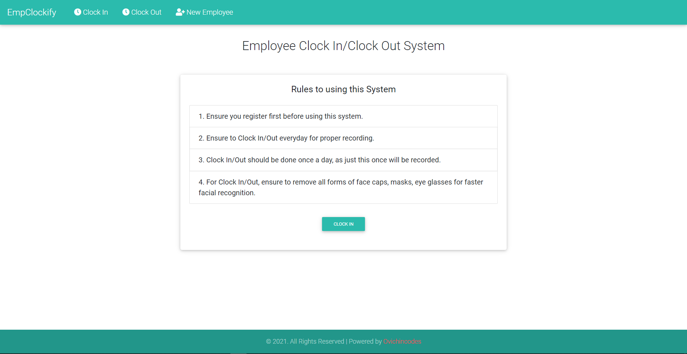
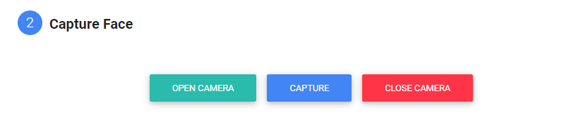
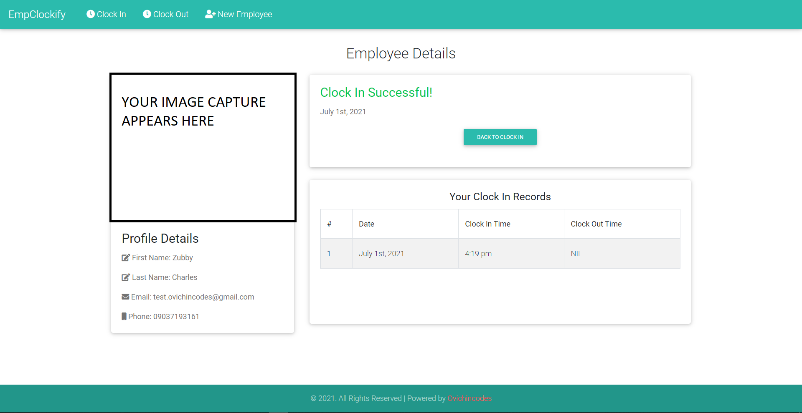

<h1 align="center">EMPLOYEE CLOCKING SYSTEM - ECS</h1>

## About ECS

ECS (with facial recognition) is a web application built with NodeJs Express framework and the pug template engine. It was built in 2020 as a CSC final year project.
 
It uses some face models to recognize faces, get the expressions on those faces as well as the landmarks. Upon registration, the user provides an image capture of his/her face which will be used when clocking in or out to recognize the user and authorize the user into the application.
 
 

# APP SCREENSHOTS

The following are some of the screenshots of the application

Welcome Page

 

 

Employee Registration Page

 

Dashboard page

Hope this helps someone, Thanks!
